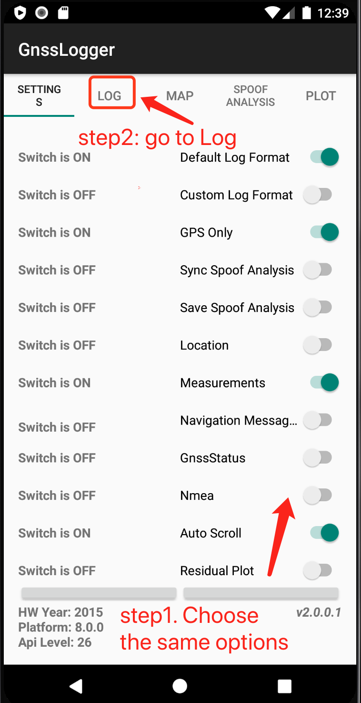
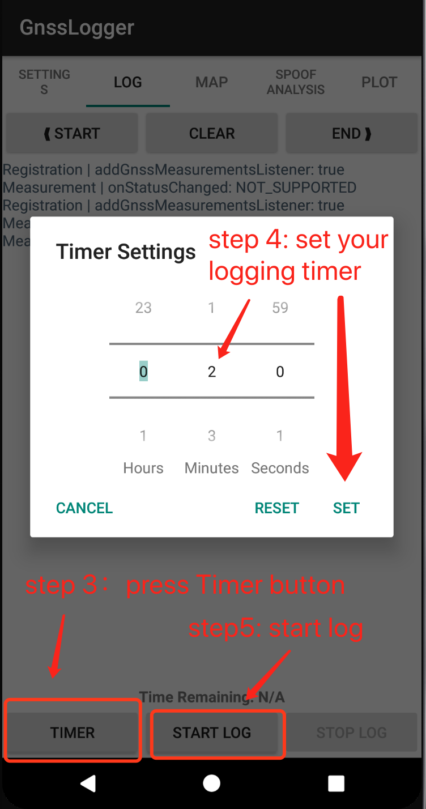
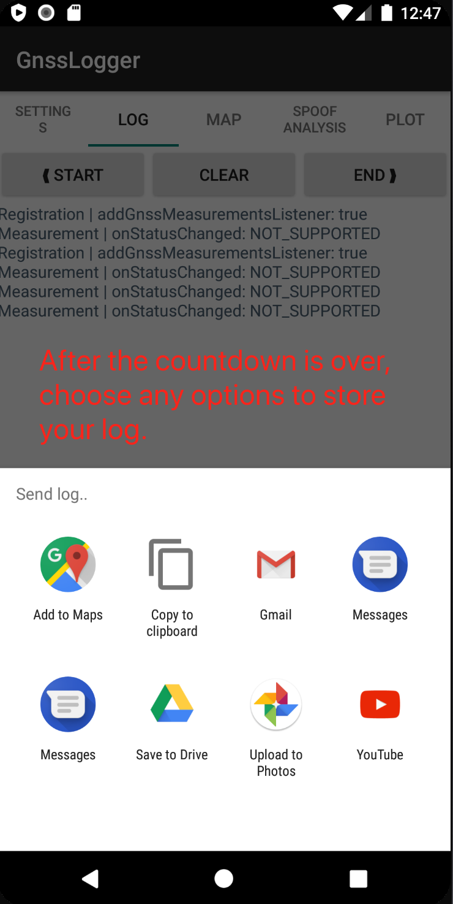
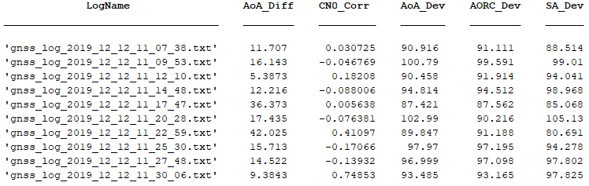

# Stars Can Tell：Robust GPS Antispoofing

Code release for USENIX Security'21 paper " **Stars Can Tell: A Robust Method to Defend against GPS Spoofing using Off-the-shelf Chipset** ". 

Check [our website](https://sites.google.com/uchicago.edu/starscantell) for the [technical paper](https://www.shinan.info/wp-content/uploads/2021/02/security21.pdf), apk release, dataset, and more.

If you end up building on this research or code as part of a project or publication, please include a reference to the USENIX Security paper:

```latex
@inproceedings{liu2021stars,
    title = {Stars Can Tell: A Robust Method to Defend against GPS Spoofing using Off-the-shelf Chipset},
    author = {Liu, Shinan and Cheng, Xiang and Yang, Hanchao and Shu, Yuanchao and Weng, Xiaoran and Guo, Ping and Zeng, (Curtis) Kexiong and Wang, Gang and Yang, Yaling},
    booktitle = {Proceedings of the 30th USENIX Security Symposium (USENIX Security 21)},
    year = {2021}
}
```
## 1. Installation
### 1.1 Analytic algorithm setup 
Before getting started, you need to install the [MATLAB](https://www.mathworks.com/products/matlab.html), our code has been tested on  MATLAB 2020a in both macOS and Window10. After installing MATLAB, download the repository to your computer and add the project repository as well as its subfolders to MATLAB search paths. 

The project's directory layout: 

    .
    ├── Analysis        # Analytic algorithm used in the paper
    ├── Config          # Config files 
    ├── Constants       # Constant values 
    ├── ExpData         # directory to place GNSS logs 
    ├── LoadData        # Scripts for reading logs 
    ├── Utils           # Utils 
    ├── LICENSE
    └── README.md

### 1.2 Install GNSSLogger app
Requirement: Android Phone with Android 8.0 or above.

We provide the apk file on [our website](https://sites.google.com/uchicago.edu/starscantell) and you can use it to install the customized GNSSLogger app on an Android  smartphone. We developed the app based on Google's [GNSS Logger](https://github.com/google/gps-measurement-tools/tree/master/GNSSLogger) and added orientation measurement on it. The app has been tested on Xiaomi MIX2, Xiaomi MI8, Xiaomi Redmi Note 7, Huawei Nova5pro, and Huawei P30. 

## 2. Collect GNSS Log Files

Follow the steps in the screenshots below to start collecting GPS signals.. 
  <p align="center">
    
    
    
  </p>

## 3. Usage 

### 3.1 Quick Hands-On
Run ```run.m``` in Matlab

We provide 10 sample log (non-spoofing in open-air) files in ```./ExpData/``` . After running the code, you will see the results of our detection algorithm.
  <p align="center">
    
  </p>


### 3.2 Use your collected log files
Change ```./Config./SetConfig.m/``` as follows and run `run.m`:
```matlab
function config = SetConfig
    config.Base = '**/'; % The folder you save you files
    config.LogFile = {
        'gnss_log_yyy_mm_dd_HH_MM_SS.txt' % The file names
        'gnss_log_yyy_mm_dd_HH_MM_SS.txt' 
        % ... 
    };
end
```

Note that the hourly ephemeris data should be placed in ```config.Base/HourlyEphemeris/```, and the code will tell you which hourly data is needed. You can download the data from [here](https://cddis.nasa.gov/archive/gnss/data/hourly/). On the website, go to the directory of the corresponding year and day, download the file named ```hourDDDD.YYn.gz```, uncompress the file, and put it into ```config.Base/HourlyEphemeris/```. 

## 4. Contact 
if you have any questions, please contact Shinan(shinanliu@uchicago.edu)

## 5. License and Acknowledgement

This project is partly inspired by GPS Measurement Tools from Google: 

https://github.com/google/gps-measurement-tools.

And we use the Apache-2.0 License.


